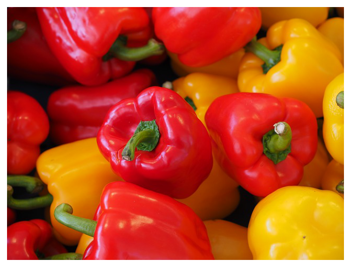
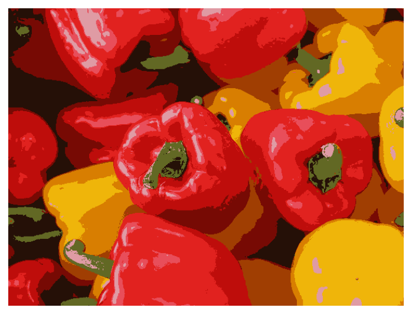
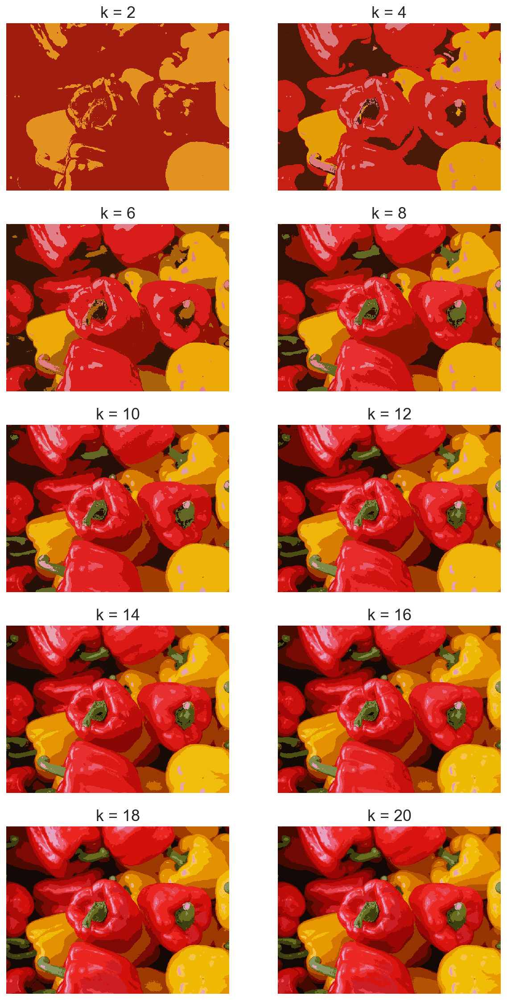

# image-filter-using-kmean-clustering
## K-means is one of the most basic clustering algorithms. It relies on finding cluster centers to group data points based on minimizing the sum of squared errors between each datapoint and its cluster center.
# In this repository, we are using k-mean to quantized the RGB color of a image to get some interesting results

## Input

## Output

